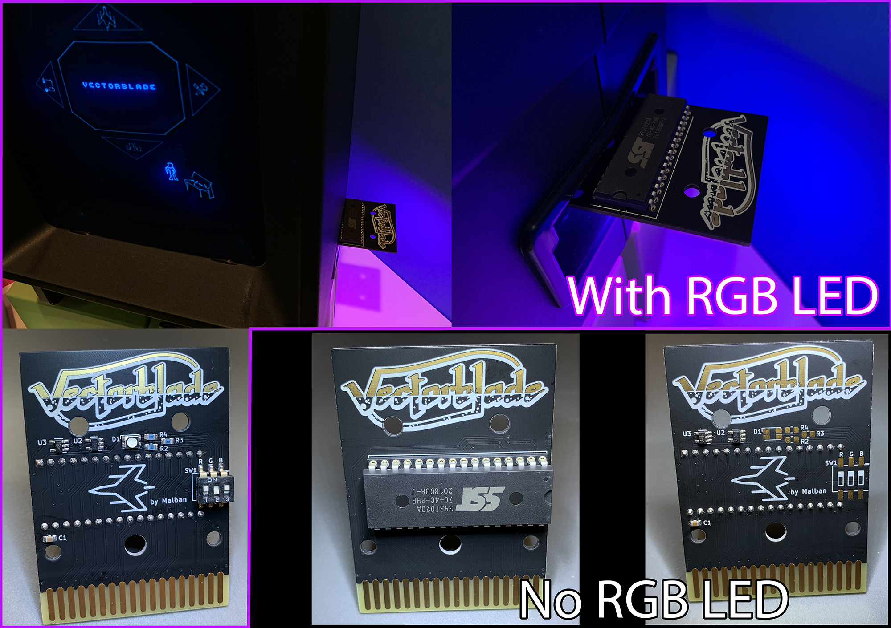

Vectrex Vectorblade PCB by Brett Walach
===

[Malban's Vectorblade PCB design](http://vide.malban.de/vectorblade/building-vectorblade/vectorblade-build-the-hardware), optimized with single gate SMT IC's (AND & NOT), 8 color RGB LED, and some gorgeous artwork applied.  Looks great in black soldermask with ENIG (gold flash) finish!

Yes these fit in [Sean Kelly reproduction cartridge shells](http://www.vectrexmulti.com/order2.html#!/Vectrex-Empty-Cartridge-Shells/c/38886086/offset=0&sort=normal) perfectly!

BOM and Parts ordering
===

All the parts are described in [Bill of Materials](bom/)

You can use this Digi-Key shared cart to order the parts!
[Vectrex Vectorblade](https://www.digikey.com/short/90np89zn)

Ordering PCB's
===

OSHPark is a good place to order with purple or the new "after dark" theme color scheme.  You can upload the KiCad `vextrex-vectorblade.kicad_pcb` there directly.  I would download this entire Github repo ZIP file first though instead of just trying to save the PCB file from your browser.

Another way to order PCB's is by using the included [gerbers](gerbers/vectrex-vectorblade-v1.0.zip) and uploading those with all of the necessary specs to companies like [PCBWay](https://www.pcbway.com) or [JLCPCB](https://jlcpcb.com)

Don't forget to make your board finish at least ENIG (gold flash) with a 45 degree chamfered edge.

LICENSE
===

CERN OHL v2.0 Permissive - essentially do whatever you want, but if you make a ton of money off of this... [buy me a coffee please!](https://buymeacoffee.com/walach)  Full [LICENSE here](LICENSE)
